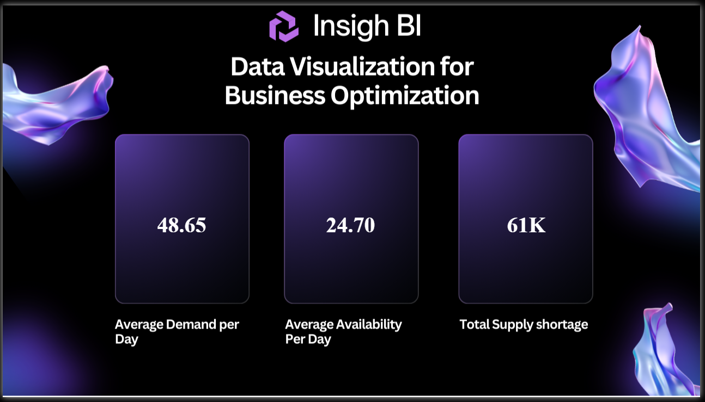
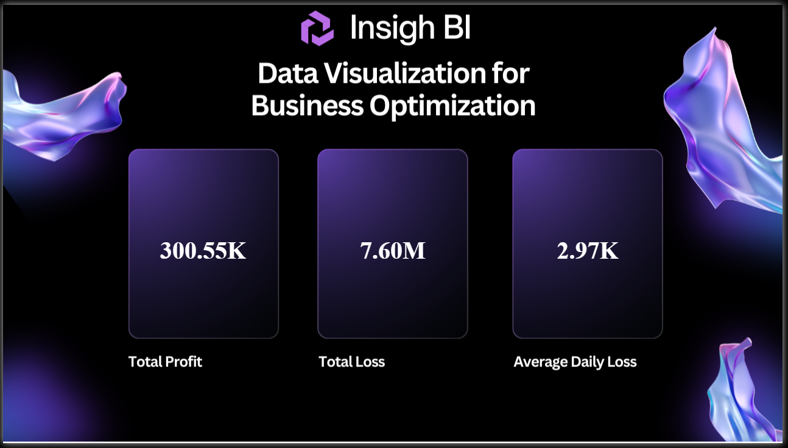

# Inventory Data Analysis
Power BI | SQL Server | MySQL | Dataflows | DAX | Data Analytics

## Project Summary
End-to-end inventory data analysis project focused on demand vs availability, supply shortages, profit/loss analysis, and business optimization.

The project simulates a real-world enterprise scenario where inventory data is sourced from SQL Server and MySQL, transitioned across test and production environments, and analyzed using Power BI Desktop, Dataflows, and advanced DAX measures to support operational and financial decision-making.

### Tools & Technologies
- Power BI Desktop & Power BI Service
- Power BI Dataflows
- SQL Server (Test & Production Environments)
- MySQL Database
- SQL (Joins, Data Cleaning, Environment Transition)
- Power Query (ETL & Data Transformation)
- DAX (SUM, SUMX, DIVIDE, FILTER, DISTINCTCOUNT)

### Data Source
- Inventory datasets stored in SQL Server and MySQL
- Tables created using LEFT JOIN between inventory and product datasets
- Environment transition handled between Test → Production
- Consistent table & column naming maintained to preserve DAX logic

### Key Responsibilities
- Imported inventory data into SQL Server test and production environments
- Performed data validation and cleaning using SQL
- Created Dataflows for reusable and scalable data ingestion
- Transitioned reports between SQL Server and MySQL using Power Query Advanced Editor
- Built KPI measures for demand, availability, shortages, profit, and loss
- Designed executive-style Power BI dashboards with filters and slicers
- Published reports to Power BI Service workspaces

### Key Metrics & Analysis
- Average demand per day
- Average availability per day
- Total supply shortage
- Total profit and total loss
- Average daily loss
- Product-level inventory performance
- Demand vs availability comparison

## How to Use the Dashboard
- Use filters and slicers to analyze demand, availability, and shortages
- Compare product-level inventory performance and profit/loss trends
- Monitor demand vs availability to identify supply gaps

## Report Screenshots (Power BI)

### Inventory Demand & Supply Overview

### Inventory Profit & Loss Analysis

### Business Insights
- Demand consistently exceeds availability, resulting in measurable supply shortages
- Inventory imbalance directly impacts profit and operational efficiency
- Certain products contribute more to losses, indicating optimization opportunities
- KPI-driven dashboards enable quick decision-making for inventory planning

### Outcome
Delivered a production-ready Power BI inventory analytics solution integrating multiple databases, environment transitions, and advanced DAX, enabling stakeholders to monitor inventory health and financial impact effectively.

### Skills Demonstrated
- Inventory & Supply Chain Analytics
- SQL & Relational Databases
- Dataflows & ETL Pipelines
- Advanced DAX Calculations
- Power BI Dashboard Design
- Business & Financial Analysis

## Data Ethics & Disclaimer
This project uses a synthetic or simulated dataset for educational and analytical purposes only.
It does not represent real company inventory or financial data.
